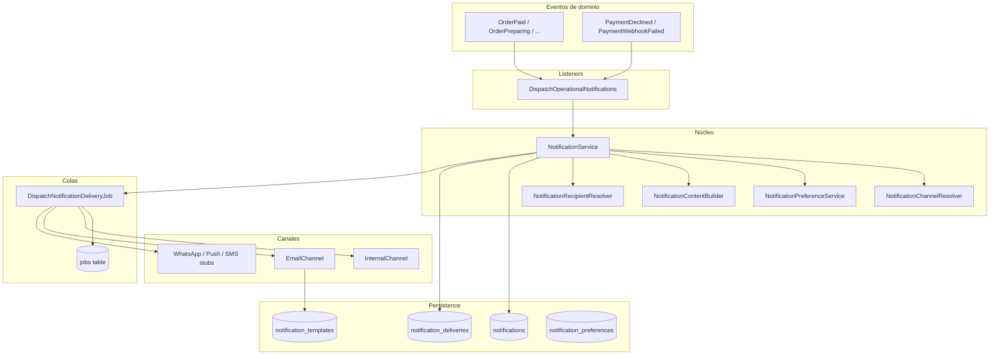

# Sistema de notificaciones BeefFresh

**Última actualización:** 2026-05-25

## Objetivo

Núcleo desacoplado de notificaciones automáticas para clientes, despachadores, domiciliarios y operaciones. Soporta múltiples canales sin acoplar el dominio de pedidos/pagos.

## Mapa de arquitectura



## Flujo de envío

1. Un **evento de dominio** ocurre (p. ej. `OrderPreparing` tras `OrderWorkflowService::transition()`).
2. **`DispatchOperationalNotifications`** construye payload y llama a **`NotificationService::notifyType()`**.
3. El servicio resuelve **destinatarios** (`config/notifications.php` → audiences) y **canales** (config + preferencias usuario).
4. Crea registro en **`notifications`** (canal internal) y filas en **`notification_deliveries`** por canal.
5. Encola **`DispatchNotificationDeliveryJob`** (colas `notifications` / `notifications-email`).
6. El job ejecuta el **driver de canal** (`NotificationChannelManager`) y actualiza estado (`sent` / `failed` / `skipped`).

## Tablas

| Tabla | Propósito |
|-------|-----------|
| `notifications` | Centro interno (inbox): título, cuerpo, payload, `read_at` |
| `notification_deliveries` | Trazabilidad por canal: status, intentos, tiempos, errores |
| `notification_templates` | Plantillas email (Blade) por tipo/canal |
| `notification_preferences` | Preferencias usuario (email/internal/push futuro) |
| `jobs` | Cola Laravel (`QUEUE_CONNECTION=database`) |

## Eventos de dominio

| Evento | Origen |
|--------|--------|
| `OrderPaid` | Pago aprobado (`PaymentWebhookProcessor`) |
| `OrderPreparing` | Transición workflow |
| `OrderReadyForDelivery` | Transición workflow |
| `OrderAssigned` | `CourierAssignmentService` |
| `OrderPickedUp` / `OrderInTransit` / `OrderDelivered` | Transición workflow |
| `OrderFailed` / `OrderReturnedToStore` | Transición workflow |
| `OrderUnassigned` | Pedido listo sin domiciliario |
| `OrderDelayed` | Comando `notifications:check-delayed-orders` |
| `PaymentDeclined` | Pago rechazado |
| `PaymentWebhookFailed` | Error procesando webhook Wompi |

## Canales

| Canal | Estado | Clase |
|-------|--------|-------|
| `internal` | Activo | `InternalNotificationChannel` |
| `email` | Activo | `EmailNotificationChannel` |
| `whatsapp` | Stub | `WhatsAppNotificationChannel` |
| `push` | Stub | `PushNotificationChannel` |
| `sms` | Stub | `SmsNotificationChannel` |

## UI

- **Campana** `<x-notifications.bell />` en tienda y panel staff.
- **Listado** `/notificaciones` con preferencias y marcar leídas.
- **Feed JSON** `/notificaciones/feed` (contador + recientes).
- **Métricas admin** en `/dashboard` (enviadas, fallidas, pendientes, tiempo prom.).

## Configuración

```env
QUEUE_CONNECTION=database
NOTIFICATION_QUEUE=notifications
NOTIFICATION_EMAIL_QUEUE=notifications-email
NOTIFICATION_JOB_TRIES=3
NOTIFICATION_DELAYED_ORDER_MINUTES=45
MAIL_MAILER=log   # recomendado en local
```

### Worker

```bash
php artisan queue:work database --queue=notifications,notifications-email --tries=3
```

### Pedidos retrasados (scheduler)

```bash
php artisan notifications:check-delayed-orders
# Programar cada hora en app/Console/Kernel.php
```

## Tests

```bash
php artisan test tests/Feature/Notifications/NotificationSystemTest.php
```

## Extensión futura

1. Implementar `NotificationChannelInterface` para WhatsApp/Push/SMS.
2. Registrar driver en `NotificationChannelManager`.
3. Activar canal en `config/notifications.php` por tipo.
4. Añadir plantilla en `notification_templates` si aplica.

No modificar servicios de pedidos/pagos: solo emitir eventos de dominio.
